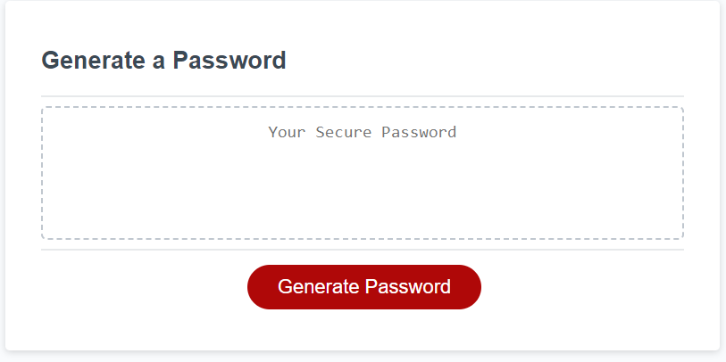
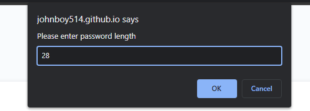
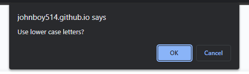
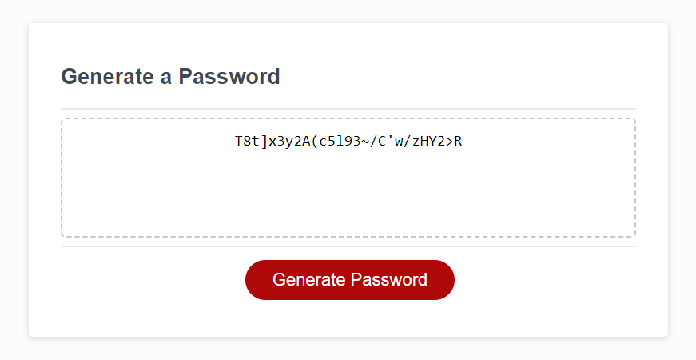

# Password-Generator

# Module-3-Challenge

## Description

This project was used to further my understanding of arrays and how to make sure that when creating an array using other arrays that they are correctly incorporated into the final displayed array. 

## Table of Contents

 - [Installation](#installation)
 - [Usage](#usage)
 - [Credits](#credits)
 - [License](#license)

## Installation

To use this project the user needs to open the index.html in a browser. it can also be reached on github live pages from this link https://johnboy514.github.io/Password-Generator/

## Usage

To use this project, the user can click on the red button labled "Generate Password" this will then prompt the user to choose a length, then what types of symbols they want added into the password. After that the password will be generated and displayed in the box above the button.

## Credits

Robert Obernier
https://github.com/rjo6615

## License

N/A
